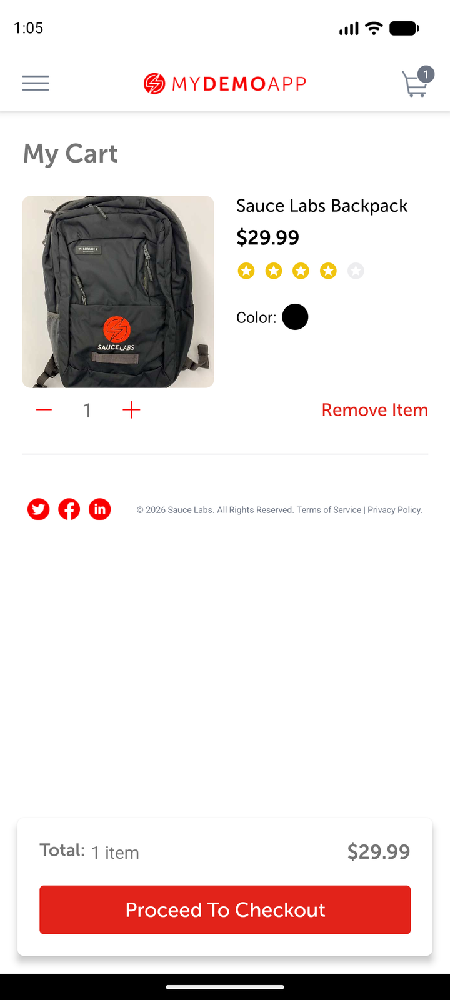

# Add-product and cart observation

## Scope and source

Assignment case: add an item and verify the cart. Product, quantity, item price, and total below are
live observations on the selected build.

## Runtime metadata

| Item | Observed value |
|---|---|
| UTC time | 2026-09-02T19:31:40Z |
| Device / platform | `emulator-5554`, `sdk_gphone16k_arm64`; Android 17 / API 37; portrait |
| App / package | My Demo App RN 1.3.0 build 244 / `com.saucelabs.mydemoapp.rn` |
| APK SHA-256 | `703fe31311b9ff16557264f23d581ad95bf9bd4cb8f2897e52cdd20b5d49a407` |
| Automation | Appium MCP embedded UiAutomator2; standalone Appium 3.7.0 / driver 8.5.2 available |
| Reset/session | App-data clear; `noReset=false`, UDID/APK/package capabilities |

## Preconditions

Clean, signed-out Products state with empty cart; compatibility dialog dismissed.

## Observations

1. The exact-text Backpack selector opened accessibility ID `product screen`.
2. MCP `scroll_to_element` checked accessibility ID `Add To Cart button`; it was already visible on
   this device. Tapping it made `cart badge` display count `1`.
3. Tapping `cart badge` opened accessibility ID `cart screen`.
4. My Cart visibly contained `Sauce Labs Backpack`, quantity `1`, item price `$29.99`, `Total: 1
   item`, and total `$29.99`.

## Locator inventory

| Screen | Semantic name | Preferred strategy | Exact selector | Observed class/content | Scroll | Confidence |
|---|---|---|---|---|---|---|
| Product | Add | Accessibility ID | `Add To Cart button` | Clickable node | Checked; not needed here | Proven |
| Header | Cart | Accessibility ID | `cart badge` | Clickable `android.view.ViewGroup`; child count `1` | No | Proven |
| Cart | Root | Accessibility ID | `cart screen` | `android.widget.ScrollView` | No | Proven |
| Cart | Product | Android UIAutomator | `new UiSelector().text("Sauce Labs Backpack")` | Exact visible text | No | Proven |
| Cart | Item price | Android UIAutomator | `new UiSelector().text("$29.99")` | Exact visible text | No | Proven |
| Cart | Quantity control | Accessibility ID | `counter amount` | Container with visible child text `1` | No | Proven |
| Cart | Checkout | Accessibility ID | `Proceed To Checkout button` | Clickable node | No | Proven |

## Assertions

Cart root, product name, quantity one, item price `$29.99`, and visible total `$29.99` were checked.

## Cleanup

App data was cleared. Final clean-state inspection found Products and zero visible text-count `1`
nodes. The MCP session was deleted successfully.

## Case mapping and gaps

Maps to CSV case **Add a product and verify the cart**; verified. Multiple products, quantity changes,
removal, taxes, other devices, and landscape were not tested.
