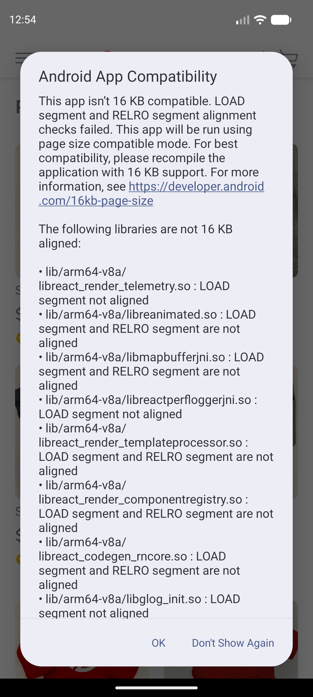
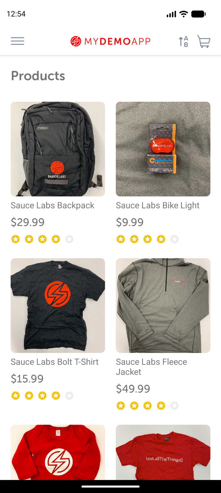
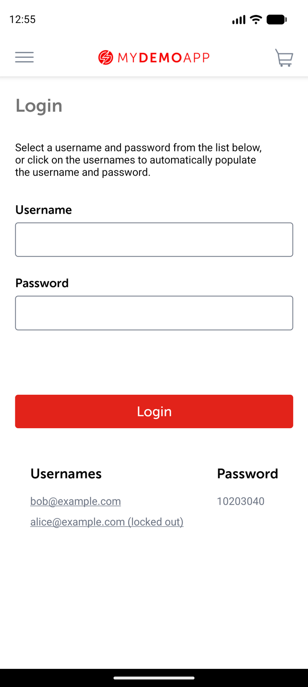

# My Demo App Android: catalog-to-login locator observation

## Scope and evidence status

This is a partial Appium MCP exploration of the catalog-to-login navigation used by the assignment.
It proves the listed screen/navigation locators on one emulator and app build. It does **not** prove
valid login, invalid login behavior, cart behavior, or checkout behavior end to end.

## Runtime metadata

| Item | Observed value |
|---|---|
| Observation time | 2026-09-02T19:25:22Z |
| Platform | Android |
| Device | `emulator-5554` / `sdk_gphone16k_arm64` |
| OS/API | Android 17 / API 37 |
| Orientation | Portrait |
| Automation | Appium MCP embedded server / UiAutomator2 |
| Standalone Appium available | Appium 3.7.0, UiAutomator2 8.5.2 |
| App | Sauce Labs My Demo App RN 1.3.0, version code 244 |
| Package | `com.saucelabs.mydemoapp.rn` |
| APK | `Android-MyDemoAppRN.1.3.0.build-244.apk` |
| APK SHA-256 | `703fe31311b9ff16557264f23d581ad95bf9bd4cb8f2897e52cdd20b5d49a407` |
| Session state | `noReset=false`, permissions automatically granted |

## Preconditions and compatibility observation

The emulator was booted and the APK existed at the configured project path. Session creation
reinstalled/reset the app. Android 17 displayed an **Android App Compatibility** dialog because the
2022 APK's native libraries are not 16 KB page-aligned. The OS stated that it would use page-size
compatibility mode. Appium MCP dismissed **Don't Show Again** for this session before app-element
inspection.

## Observed steps

1. Created a clean Android Appium MCP session with package `com.saucelabs.mydemoapp.rn`.
2. Dismissed the Android compatibility dialog.
3. Confirmed the catalog root with accessibility ID `products screen`.
4. Confirmed the header menu control with accessibility ID `open menu`.
5. Confirmed the backpack label with Android UIAutomator selector
   `new UiSelector().textContains("Sauce Labs Backpack")`.
6. Tapped `open menu` and confirmed `menu item log in`; it was already visible and needed no scroll
   on this device.
7. Tapped `menu item log in` and confirmed the login root and its username, password, submit, and
   generic-error elements by accessibility ID.
8. Deleted the MCP session successfully.

## Locator inventory

| Screen | Semantic element | Preferred strategy | Exact selector | Observed runtime evidence | Scroll | Confidence |
|---|---|---|---|---|---|---|
| Catalog | Screen root | Accessibility ID | `products screen` | Element returned by Appium MCP | No | Proven |
| Catalog | Open menu | Accessibility ID | `open menu` | Clickable element returned and tap opened drawer | No | Proven |
| Catalog | Backpack label | Android UIAutomator | `new UiSelector().textContains("Sauce Labs Backpack")` | Text element returned by Appium MCP | No on this device | Proven |
| Menu | Login item | Accessibility ID | `menu item log in` | Element returned and tap opened login | No on this device; allow semantic scroll | Proven |
| Login | Screen root | Accessibility ID | `login screen` | Element returned after menu navigation | No | Proven |
| Login | Username | Accessibility ID | `Username input field` | Element returned by Appium MCP | No | Proven |
| Login | Password | Accessibility ID | `Password input field` | Element returned by Appium MCP | No | Proven |
| Login | Submit | Accessibility ID | `Login button` | Element returned by Appium MCP | No | Proven |
| Login | Generic error container | Accessibility ID | `generic-error-message` | Element returned before input; error-result text not exercised | No | Locator proven; behavior unverified |

No XPath or coordinate locator was needed.

## Assertions actually checked

- Catalog root was discoverable after clean session startup and compatibility-dialog dismissal.
- Menu navigation reached the login screen.
- The four login-related accessibility IDs above resolved on the login screen.

No credentials were entered, and no login assertion was executed in this observation.

## Case mapping and gaps

| Assignment case | Evidence in this record | Status |
|---|---|---|
| Valid login | Catalog-to-login navigation and input/button locators | Partial; outcome unverified |
| Invalid login | Input/button/error-container locators | Partial; error text unverified |
| Add item and verify cart | Backpack discovery only | Partial; product/cart flow unverified |
| Checkout step | None beyond login navigation | Unverified |

The mobile planner must perform and append full case observations before treating these four cases as
Appium-MCP-verified automation scope. Android 17 compatibility behavior may differ from API 35/36 and
must not be generalized to other devices.
