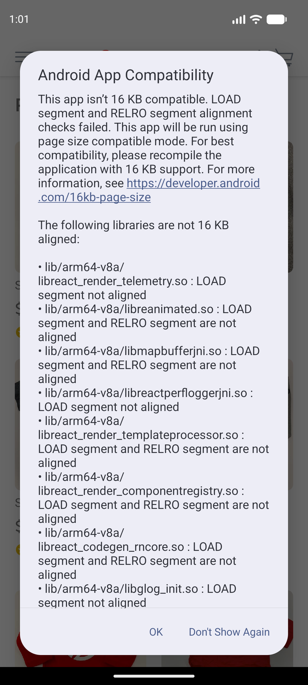
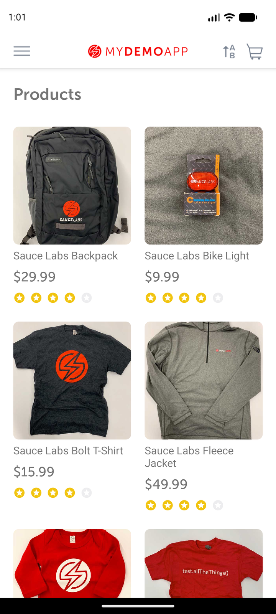
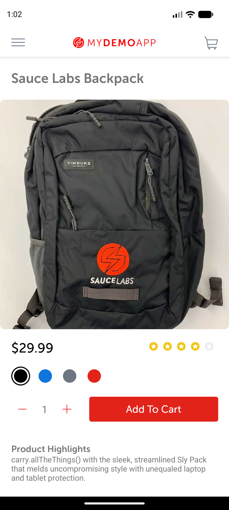

# Catalog product-details observation

## Scope and source

Assignment case: open a catalog product and verify its details. The expected catalog/product path is
required by the assignment; the exact name and price below were observed live on this app build.

## Runtime metadata

| Item | Observed value |
|---|---|
| UTC time | 2026-09-02T19:31:40Z |
| Device | `emulator-5554` / `sdk_gphone16k_arm64` |
| Platform | Android 17 / API 37, portrait, `en_US` |
| App | Sauce Labs My Demo App RN 1.3.0 / build 244 |
| Package | `com.saucelabs.mydemoapp.rn` |
| APK / SHA-256 | `Android-MyDemoAppRN.1.3.0.build-244.apk` / `703fe31311b9ff16557264f23d581ad95bf9bd4cb8f2897e52cdd20b5d49a407` |
| Automation | Appium MCP embedded server, UiAutomator2; standalone Appium 3.7.0 / UiAutomator2 8.5.2 available |
| Session | `noReset=false`; APK path, UDID, package, and `newCommandTimeout=300` supplied |

## Preconditions

App data was clean. Android displayed its 16 KB **Android App Compatibility** dialog; **Don't Show
Again** was dismissed before app inspection. The app opened on Products with an empty cart.

## Observations

1. On startup, accessibility ID `products screen` resolved and the catalog showed Sauce Labs
   Backpack at `$29.99`.
2. Android UIAutomator `new UiSelector().text("Sauce Labs Backpack")` resolved; tapping it opened
   accessibility ID `product screen`.
3. The detail screen exposed the same product name and `$29.99` through exact-text UIAutomator
   selectors.

## Locator inventory

| Screen | Semantic name | Preferred strategy | Exact selector | Observed class/content | Scroll | Confidence |
|---|---|---|---|---|---|---|
| Catalog | Root | Accessibility ID | `products screen` | Accessibility node returned | No | Proven |
| Catalog | Backpack | Android UIAutomator | `new UiSelector().text("Sauce Labs Backpack")` | `android.widget.TextView`, text and content-desc `store item text` | No | Proven |
| Product | Root | Accessibility ID | `product screen` | Accessibility node returned | No | Proven |
| Product | Name | Android UIAutomator | `new UiSelector().text("Sauce Labs Backpack")` | Exact visible text | No | Proven |
| Product | Price | Android UIAutomator | `new UiSelector().text("$29.99")` | Exact visible text | No | Proven |

No resource IDs were exposed and no XPath or coordinate locator was needed.

## Assertions

The product detail root, `Sauce Labs Backpack`, and `$29.99` were all found after the tap.

## Cleanup

App data was cleared after this case. Final suite cleanup later confirmed Products and no visible cart
count. The MCP session was deleted successfully after all five observations.

## Case mapping and gaps

Maps to CSV case **Open a catalog product and verify its details**; verified. Not checked on other
devices, API levels, orientations, locales, or app builds. Network-failure rendering was not tested.
