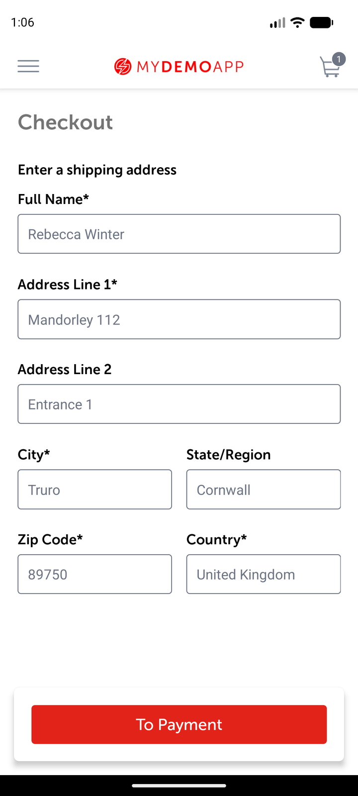

# Checkout-address observation

## Scope and source

Assignment case: exercise a checkout step. The retained case ends at the shipping-address form; it
does not place an order or submit personal/payment data.

## Runtime metadata

| Item | Observed value |
|---|---|
| UTC time | 2026-09-02T19:31:40Z |
| Device / platform | `emulator-5554`, `sdk_gphone16k_arm64`; Android 17 / API 37; portrait |
| App / package | My Demo App RN 1.3.0 build 244 / `com.saucelabs.mydemoapp.rn` |
| APK SHA-256 | `703fe31311b9ff16557264f23d581ad95bf9bd4cb8f2897e52cdd20b5d49a407` |
| Automation | Appium MCP embedded UiAutomator2; standalone Appium 3.7.0 / driver 8.5.2 available |
| Reset/session | App-data clear; `noReset=false`, UDID/APK/package capabilities |

## Preconditions

App data was cleared and the compatibility dialog dismissed. The demo account began signed out and
the cart empty. Valid credentials were provided only at runtime.

## Observations

1. The valid-login path returned to accessibility ID `products screen`.
2. Sauce Labs Backpack was opened, `Add To Cart button` tapped, and `cart badge` opened.
3. `cart screen` resolved with the Backpack; `Proceed To Checkout button` was tapped.
4. Accessibility ID `checkout address screen` resolved. Required input accessibility IDs `Full
   Name* input field`, `Address Line 1* input field`, `City* input field`, `Zip Code* input field`,
   and `Country* input field` all resolved, as did `To Payment button`.

## Locator inventory

| Screen | Semantic name | Preferred strategy | Exact selector | Observed class/content | Scroll | Confidence |
|---|---|---|---|---|---|---|
| Cart | Proceed | Accessibility ID | `Proceed To Checkout button` | Clickable node | No | Proven |
| Checkout | Root | Accessibility ID | `checkout address screen` | Accessibility node returned | No | Proven |
| Checkout | Full name | Accessibility ID | `Full Name* input field` | Input node returned | No | Proven |
| Checkout | Address line 1 | Accessibility ID | `Address Line 1* input field` | Input node returned | No | Proven |
| Checkout | City | Accessibility ID | `City* input field` | Input node returned | No | Proven |
| Checkout | Zip code | Accessibility ID | `Zip Code* input field` | Input node returned | No | Proven |
| Checkout | Country | Accessibility ID | `Country* input field` | Input node returned | No | Proven |
| Checkout | Continue | Accessibility ID | `To Payment button` | Clickable node returned | No | Proven |

## Assertions

The checkout shipping-address root, five required inputs, and To Payment control were visible. No
address was entered and no payment/order operation occurred.

## Cleanup

App data was cleared, the app was activated, the compatibility dialog dismissed, Products found,
and no cart-count `1` remained. MCP session `3209b456-af0e-4d4a-b8c3-201b591cfefe` was deleted; MCP
then reported no active sessions.

## Case mapping and gaps

Maps to CSV case **Proceed from cart to checkout address**; verified. Address validation, payment,
order confirmation, backend side effects, other devices/APIs/orientations, and accessibility with
screen readers were not tested.
