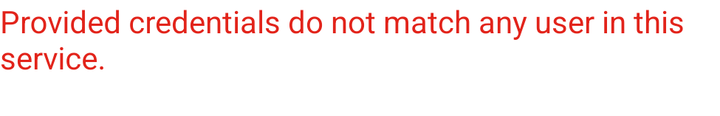

# Invalid-login observation

## Scope and source

Assignment case: invalid login. Invalid values were supplied at runtime and are not retained. The
exact rejection text is a live observation on the selected build.

## Runtime metadata

| Item | Observed value |
|---|---|
| UTC time | 2026-09-02T19:31:40Z |
| Device / platform | `emulator-5554`, `sdk_gphone16k_arm64`; Android 17 / API 37; portrait |
| App / package | My Demo App RN 1.3.0 build 244 / `com.saucelabs.mydemoapp.rn` |
| APK SHA-256 | `703fe31311b9ff16557264f23d581ad95bf9bd4cb8f2897e52cdd20b5d49a407` |
| Automation | Appium MCP embedded UiAutomator2; standalone Appium 3.7.0 / driver 8.5.2 available |
| Reset/session | App-data clear; `noReset=false`, UDID/APK/package capabilities |

## Preconditions

App data was cleared, the compatibility dialog was dismissed, and the app was signed out on Products.

## Observations

1. `open menu` and `menu item log in` navigated to accessibility ID `login screen`.
2. Runtime-supplied invalid values were entered through `Username input field` and `Password input
   field`; `Login button` was tapped. Password text was masked, and no screen containing credentials
   was retained.
3. Accessibility ID `generic-error-message` resolved. Its child text was observed through the focused
   hierarchy as `Provided credentials do not match any user in this service.` The login screen remained.

## Locator inventory

| Screen | Semantic name | Preferred strategy | Exact selector | Observed class/content | Scroll | Confidence |
|---|---|---|---|---|---|---|
| Login | Username | Accessibility ID | `Username input field` | `android.widget.EditText` | No | Proven |
| Login | Password | Accessibility ID | `Password input field` | `android.widget.EditText`; masked value | No | Proven |
| Login | Submit | Accessibility ID | `Login button` | Clickable node | No | Proven |
| Login | Error container | Accessibility ID | `generic-error-message` | Container resolved after submit | No | Proven |
| Login | Exact error text | Android UIAutomator | `new UiSelector().text("Provided credentials do not match any user in this service.")` | `android.widget.TextView` | No | Proven |

## Assertions

The login screen remained and showed exactly: `Provided credentials do not match any user in this
service.`

## Cleanup

App data was cleared after the case. The MCP session was deleted successfully after all observations.

## Case mapping and gaps

Maps to CSV case **Reject invalid login credentials**; verified. Empty-field validation, locked-out
accounts, rate limiting, and alternate backends were not tested.
