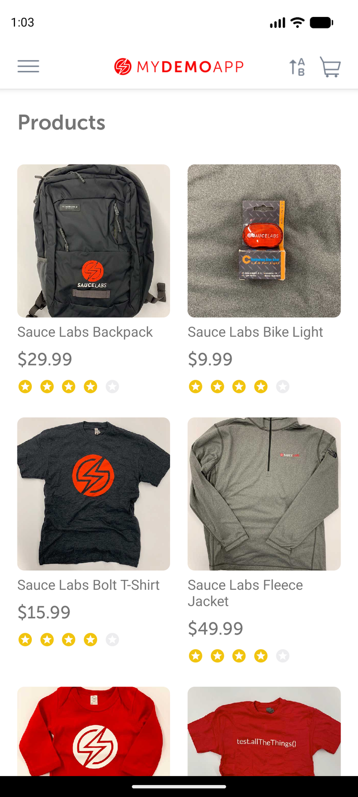

# Valid-login observation

## Scope and source

Assignment case: valid login. Credentials came from the demo app's documented test account and were
entered at runtime; no password is retained in this record or its screenshot.

## Runtime metadata

| Item | Observed value |
|---|---|
| UTC time | 2026-09-02T19:31:40Z |
| Device / platform | `emulator-5554`, `sdk_gphone16k_arm64`; Android 17 / API 37; portrait |
| App / package | My Demo App RN 1.3.0 build 244 / `com.saucelabs.mydemoapp.rn` |
| APK SHA-256 | `703fe31311b9ff16557264f23d581ad95bf9bd4cb8f2897e52cdd20b5d49a407` |
| Automation | Appium MCP embedded UiAutomator2; standalone Appium 3.7.0 / driver 8.5.2 available |
| Reset/session | App-data clear; `noReset=false`, UDID/APK/package capabilities |

## Preconditions

App data was cleared and the compatibility dialog was dismissed. Start state was Products, signed
out, with an empty cart.

## Observations

1. Accessibility ID `open menu` opened the drawer; `menu item log in` opened `login screen`.
2. `Username input field` and `Password input field` accepted the runtime-supplied valid demo
   credentials. `Login button` was tapped. No credential-entry screenshot was retained.
3. Accessibility ID `products screen` resolved after submit and the Products catalog was visible.

## Locator inventory

| Screen | Semantic name | Preferred strategy | Exact selector | Observed class/content | Scroll | Confidence |
|---|---|---|---|---|---|---|
| Catalog | Menu | Accessibility ID | `open menu` | Clickable `android.view.ViewGroup` | No | Proven |
| Menu | Log in | Accessibility ID | `menu item log in` | Clickable accessibility node | No | Proven |
| Login | Root | Accessibility ID | `login screen` | Accessibility node returned | No | Proven |
| Login | Username | Accessibility ID | `Username input field` | `android.widget.EditText` | No | Proven |
| Login | Password | Accessibility ID | `Password input field` | `android.widget.EditText`; value masked | No | Proven |
| Login | Submit | Accessibility ID | `Login button` | Clickable `android.view.ViewGroup` | No | Proven |
| Catalog | Successful destination | Accessibility ID | `products screen` | Accessibility node returned after submit | No | Proven |

## Assertions

The Products root was found after Login and the catalog was visibly rendered.

## Cleanup

App data was cleared after the case; the compatibility dialog was handled on the next activation.
The MCP session was deleted successfully after all observations.

## Case mapping and gaps

Maps to CSV case **Log in with valid credentials**; verified. Authentication persistence, locked-out
users, biometrics, and non-default device/API/orientation behavior were not tested.
